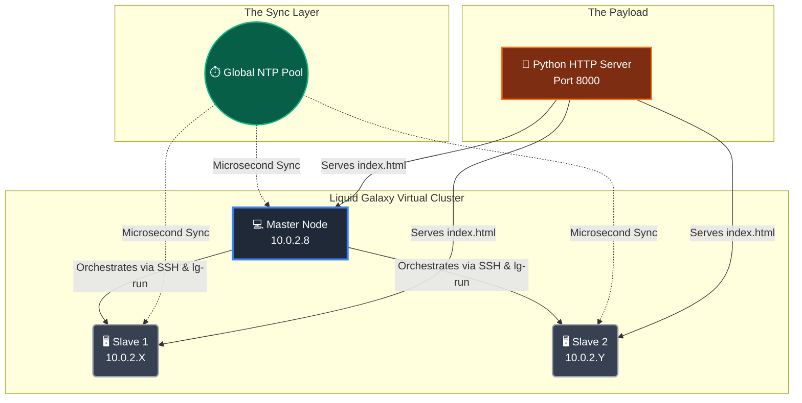

# 🌌 Liquid Galaxy: Distributed WebGL Sync Engine

<div align="center">
  
  <br><br>

  [](https://github.com/LiquidGalaxyLAB)
  [](https://www.khronos.org/webgl/)
  [](#)
  [](https://summerofcode.withgoogle.com/)
</div>

<br>

**Author:** Darpan Baviskar  
**Mission:** Engineering a zero-latency, distributed graphics architecture that safely bypasses native Google Earth locks to render synchronized 60fps web shaders across a multi-node cluster.

---

## 🚀 The Vision

Building systems that have a massive, profound impact requires breaking out of the sandbox.

Liquid Galaxy nodes are traditionally hard-locked to the Google Earth engine. This R&D experiment proves we can safely hijack the X11 display server, orchestrate a custom multi-pass WebGL2 pipeline, and synchronize absolute time across isolated virtual machines—effectively turning a standard network into a unified, panoramic render farm.

---

## 🏗️ The Architecture

To simulate a physical Liquid Galaxy rig, this cluster runs on isolated Ubuntu VMs communicating over a custom NAT Network, orchestrated entirely by the Master Node.



---

## 🥊 The Gauntlet: Challenges & Solutions

Building bare-metal clusters is never a straight line. Here is how the major technical roadblocks were dismantled.

### 1. The Virtual GPU Blockade 🛑

**The Problem:** Browsers hate virtual GPUs. Chromium detects the VMSVGA VM driver, panics, and permanently blocks WebGL2 hardware acceleration. Result? A totally black screen.

**The Fix:** Aggressively override the Chromium sandbox by injecting low-level GPU rasterization flags directly into the X11 launch command:

```
--ignore-gpu-blocklist --enable-gpu-rasterization --enable-zero-copy --disable-gpu-vsync
```

### 2. The Time-Drift Tearing ⏱️

**The Problem:** VMs share physical CPU cycles, meaning their internal clocks constantly pause and drift by 20–50ms. Absolute time functions like `Date.now()` fall out of sync, causing the visual waves to literally tear at the monitor bezels.

**The Fix:** Deployed Chrony (NTP). Scripted a forceful `systemctl restart chrony` across the cluster right before launch. This triggers a massive atomic clock step-sync, locking all three OS clocks to the exact same microsecond.

### 3. The Google Earth "Zombie" Daemon 🧟

**The Problem:** Simply running `killall googleearth-bin` doesn't work. The native Liquid Galaxy watchdog script (`run-earth-bin.sh`) detects the crash and instantly revives Google Earth within milliseconds.

**The Fix:** Used Liquid Galaxy's native `lg-run` broadcaster to assassinate both the parent loop and the child process simultaneously:

```bash
lg-run 'sudo pkill -f run-earth-bin.sh; sudo pkill -f googleearth-bin'
```

### 4. The Firewall Trap 🧱

**The Problem:** Liquid Galaxy's rigorous `iptables` setup blocks standard web traffic across the cluster, causing "Connection Timed Out" errors when Slaves try to fetch the shader.

**The Fix:** Punched a direct TCP hole in the Master's input chain to serve the payload:

```bash
sudo iptables -I INPUT -p tcp --dport 8000 -j ACCEPT
```

---

## 🕹️ The Playbook

Want to see it in action? The entire deployment is executed with zero manual interaction on the Slave nodes.

### Step 1: Serve the Payload (On Master)

```bash
python3 -m http.server 8000 &
```

### Step 2: Clear the Stage & Sync Clocks (On Master)

```bash
# Eradicate GE and force a microsecond time sync
lg-run 'sudo pkill -f run-earth-bin.sh; sudo pkill -f googleearth-bin'
lg-run 'sudo systemctl restart chrony'
```

### Step 3: Deploy the Renderers

```bash
# 1. Launch local Master screen
export DISPLAY=:0 && chromium-browser --kiosk "http://localhost:8000/?screen=0" &

# 2. Blast launch commands to Slaves
ssh lgS1@10.0.2.X 'export DISPLAY=:0 && chromium-browser --kiosk --ignore-gpu-blocklist "http://10.0.2.8:8000/?screen=1" > /dev/null 2>&1 &'
ssh lgS2@10.0.2.Y 'export DISPLAY=:0 && chromium-browser --kiosk --ignore-gpu-blocklist "http://10.0.2.8:8000/?screen=2" > /dev/null 2>&1 &'
```

---

## 🎥 The Result

[experiment/webgl-cluster-sync(local PC)](https://youtu.be/GQ97Axn2qS8)

[experiment/webgl-cluster-sync(LG VMs)](https://youtu.be/dUciT5otrrc)

---

## 🔮 What's Next?

- **WebSocket Orchestration:** Transitioning from passive NTP clock-sync to an active WebSocket event loop, enabling real-time, user-driven interaction (rotating the 3D model) that updates instantaneously across the cluster.

- **Bare-Metal Port:** Benchmarking this exact architecture against physical Liquid Galaxy hardware to measure native GPU rendering efficiency.

---

> *"If you want to build systems with profound impact, you have to understand the metal."*